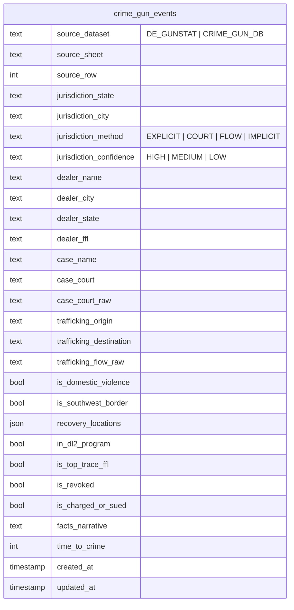

# Crime Gun Dealer DB Integration - Implementation Plan

**Project:** Brady Unified Gun Crime Database
**Version:** 1.0
**Date:** January 27, 2026
**Type:** Feature Implementation

---

## Overview

Integrate the Crime Gun Dealer Criminal Database (`Crime_Gun_Dealer_DB.xlsx`) into the Brady ETL pipeline. This dataset contains **1,981 court case records** linking FFLs to crime guns with detailed case narratives, recovery locations, and trafficking flow data.

### Strategic Value

- Court-level evidence linking FFLs to crime guns (missing from trace-only data)
- Interstate trafficking patterns from source to destination states
- Time-to-crime indicators for high-risk dealer identification
- Dealer risk profiles for nuisance litigation support

---

## Acceptance Criteria

### Functional Requirements

- [ ] Load all sheets from `Crime_Gun_Dealer_DB.xlsx` (skip Sheet7 per requirements)
- [ ] Process 1,981 CG court doc FFLs records with no data loss
- [ ] Process 54 Philadelphia Trace records with PA implicit jurisdiction
- [ ] Handle empty Rochester Trace and Backdated sheets gracefully
- [ ] Extract recovery locations from Column R with 80%+ success rate
- [ ] Parse federal district court references from Column N
- [ ] Extract trafficking flows (e.g., "AK-->CA") from Column P
- [ ] Convert boolean fields (DL2, top trace, revoked, charged) to True/False/NULL
- [ ] Parse time-to-crime to integer days
- [ ] Maintain 100% source traceability (dataset, sheet, row, method, confidence)
- [ ] Append to existing `crime_gun_events` table without data loss
- [ ] All existing tests pass, new tests added

### Data Quality Targets

| Metric | Target | Minimum |
|--------|--------|---------|
| Records with jurisdiction identified | 90% | 75% |
| High-confidence jurisdiction | 60% | 40% |
| Valid FFL state codes | 99% | 95% |
| Trafficking flows extracted | 95% | 85% |

---

## Technical Approach

### Architecture

```
Crime_Gun_Dealer_DB.xlsx
        │
        ▼
┌────────────────────────────────────────────┐
│  src/brady/etl/process_crime_gun_db.py     │
│  ├── load_crime_gun_db()                   │
│  ├── parse_recovery_locations()            │
│  ├── parse_federal_court()                 │
│  ├── parse_trafficking_flow()              │
│  ├── convert_boolean_field()               │
│  ├── parse_time_to_crime()                 │
│  ├── determine_jurisdiction()              │
│  └── transform_to_unified()                │
└────────────────────────────────────────────┘
        │
        ├──▶ data/processed/crime_gun_events.csv (append)
        │
        └──▶ data/brady.db (append to crime_gun_events table)
```

### Key Design Decisions

1. **Single record per row** - Multi-location recoveries stored as JSON array, not exploded
2. **Strict boolean conversion** - Only "Yes"/"True" = True; "Maybe"/"Unclear" = NULL
3. **Append strategy** - Use composite key (source_dataset, source_sheet, source_row) for upsert
4. **Jurisdiction priority** - Recovery location > Court > Trafficking flow > Sheet default

---

## Implementation Phases

### Phase 1: Core Module Structure

Create the new ETL module with basic loading and schema.

**Files to Create:**

```
src/brady/etl/process_crime_gun_db.py
tests/test_process_crime_gun_db.py
```

**Tasks:**

- [ ] Create `process_crime_gun_db.py` with module skeleton
- [ ] Implement `load_crime_gun_db(xlsx_path)` - loads all sheets, skips Sheet7
- [ ] Implement column mapping from source to unified schema
- [ ] Add source traceability fields (source_dataset, source_sheet, source_row)
- [ ] Create test file with fixtures from `v_2/test_fixtures.py`

**Key Functions:**

```python
# src/brady/etl/process_crime_gun_db.py

def load_crime_gun_db(xlsx_path: str) -> dict[str, pd.DataFrame]:
    """Load all sheets except Sheet7, handle empty sheets gracefully."""

COLUMN_MAP = {
    'A': 'ffl_name',           # FFL column
    'B': 'ffl_premise_street', # Address
    'C': 'ffl_premise_city',   # City
    'D': 'ffl_premise_state',  # State
    'F': 'ffl_license_number', # license number
    'N': 'case_raw',           # Case (for court parsing)
    'P': 'case_subject_raw',   # Case subject (for trafficking)
    'R': 'recovery_raw',       # Location(s) of recovery
    'S': 'recovery_info',      # Info on recoveries
    'T': 'ttc_raw',            # Time-to-crime raw
    'U': 'facts_narrative',    # Facts narrative
}
```

### Phase 2: Parsing Functions

Implement all parsing functions for extracting structured data from text fields.

**Tasks:**

- [ ] Implement `parse_recovery_locations(text)` - extracts city/state pairs
- [ ] Implement `parse_federal_court(text)` - parses "D. Alaska", "E.D. Pa.", etc.
- [ ] Implement `parse_trafficking_flow(text)` - extracts "AK-->CA" patterns
- [ ] Implement `convert_boolean_field(value)` - Yes/No to True/False/NULL
- [ ] Implement `parse_time_to_crime(text)` - text to integer days
- [ ] Implement `clean_ffl_name(text)` - handle "aka" patterns, whitespace
- [ ] Write unit tests for each parsing function

**Regex Patterns:**

```python
# Recovery location: "1. Woodland, CA" or "Sacramento, CA"
RECOVERY_PATTERN = r'(?:\d+\.\s*)?([A-Za-z\s]+),\s*([A-Z]{2})\b'

# Federal court: "D. Alaska", "E.D. Pa.", "S.D.N.Y."
COURT_PATTERN = r'([NSEWCM]\.?D\.?)\s*(?:of\s+)?([A-Za-z\.]+)'

# Trafficking flow: "AK-->CA"
FLOW_PATTERN = r'([A-Z]{2})\s*(?:-->|->|==>|=>)\s*([A-Z]{2}|SWB)'
```

**Test Cases:**

```python
# tests/test_process_crime_gun_db.py

def test_parse_recovery_locations_single():
    result = parse_recovery_locations("Sacramento, CA")
    assert result == [{"city": "Sacramento", "state": "CA"}]

def test_parse_recovery_locations_numbered_list():
    text = "1. Woodland, CA\n2. Citrus Heights, CA"
    result = parse_recovery_locations(text)
    assert len(result) == 2
    assert result[0]["state"] == "CA"
    assert result[1]["city"] == "Citrus Heights"

def test_parse_federal_court_single_district():
    result = parse_federal_court("D. Alaska")
    assert result["state"] == "AK"
    assert result["confidence"] == "HIGH"

def test_parse_federal_court_multi_district():
    result = parse_federal_court("E.D. Pa.")
    assert result["state"] == "PA"
    assert "Eastern" in result["court_name"]

def test_parse_trafficking_flow_basic():
    result = parse_trafficking_flow("AK-->CA")
    assert result["origin"] == "AK"
    assert result["destination"] == "CA"

def test_convert_boolean_yes():
    assert convert_boolean_field("Yes") is True

def test_convert_boolean_unclear():
    assert convert_boolean_field("Unclear") is None
```

### Phase 3: Jurisdiction Extraction

Implement the multi-stage jurisdiction extraction with confidence scoring.

**Tasks:**

- [ ] Create `JurisdictionResult` dataclass with state, city, method, confidence
- [ ] Implement `determine_jurisdiction(row, sheet_name)` - priority chain
- [ ] Add sheet-level defaults for Philadelphia (PA) and Rochester (NY)
- [ ] Handle dealer state fallback for non-matching FFLs
- [ ] Test jurisdiction priority with conflicting signals

**Jurisdiction Priority Chain:**

```python
@dataclass
class JurisdictionResult:
    state: Optional[str]
    city: Optional[str]
    method: str  # EXPLICIT_RECOVERY | CASE_COURT | TRAFFICKING_FLOW | IMPLICIT
    confidence: str  # HIGH | MEDIUM | LOW

def determine_jurisdiction(row: pd.Series, sheet_name: str) -> JurisdictionResult:
    """
    Priority order:
    1. Column R (recovery location) - HIGH confidence
    2. Column N (court reference) - MEDIUM-HIGH confidence
    3. Column P (trafficking destination) - MEDIUM confidence
    4. Sheet-level default - MEDIUM confidence
    5. Dealer state - LOW confidence
    """
```

### Phase 4: Schema Transformation

Map extracted data to the unified crime_gun_events schema.

**Tasks:**

- [ ] Implement `transform_to_unified(df, sheet_name)` - full schema mapping
- [ ] Add trafficking indicators (DV*, SWB) as separate columns
- [ ] Handle NULL/missing values appropriately
- [ ] Validate state codes against US_STATES set
- [ ] Log warnings for unparseable values

**Schema Additions:**

```python
# New columns for crime_gun_events table
NEW_COLUMNS = {
    'in_dl2_program': 'boolean',        # DL2 FFL flag
    'is_top_trace_ffl': 'boolean',      # Top trace designation
    'is_revoked': 'boolean',            # License revoked
    'is_charged_or_sued': 'boolean',    # Legal action status
    'case_name': 'text',                # Parsed case name
    'case_court': 'text',               # Normalized court name
    'case_court_raw': 'text',           # Original court reference
    'trafficking_origin': 'text',       # Origin state
    'trafficking_destination': 'text',  # Destination state/country
    'trafficking_flow_raw': 'text',     # Original flow text
    'is_domestic_violence': 'boolean',  # DV* indicator
    'is_southwest_border': 'boolean',   # SWB indicator
    'recovery_locations': 'json',       # Array of city/state
    'jurisdiction_method': 'text',      # EXPLICIT/COURT/FLOW/IMPLICIT
    'jurisdiction_confidence': 'text',  # HIGH/MEDIUM/LOW
}
```

### Phase 5: Database Integration

Modify database loading to append data without loss.

**Tasks:**

- [ ] Update `database.py` to support UPSERT by composite key
- [ ] Modify `load_df_to_db()` to use `if_exists='append'` with dedup
- [ ] Add migration for new schema columns
- [ ] Test incremental loading (DE Gunstat + Crime Gun DB)
- [ ] Verify dashboard loads combined data correctly

**Database Changes:**

```python
# src/brady/etl/database.py

def load_df_to_db(df: pd.DataFrame, table_name: str, db_path: str,
                  if_exists: str = 'append',
                  unique_keys: list = None) -> None:
    """
    Load DataFrame to SQLite with optional upsert behavior.

    If unique_keys provided, delete existing rows with matching keys
    before inserting new rows.
    """
    if unique_keys:
        # Delete existing records with matching source keys
        delete_existing_by_keys(db_path, table_name, df, unique_keys)

    df.to_sql(table_name, conn, if_exists=if_exists, index=False)

# Composite key for deduplication
UNIQUE_KEYS = ['source_dataset', 'source_sheet', 'source_row']
```

### Phase 6: Main Entry Point & CLI

Create the main orchestration function and CLI interface.

**Tasks:**

- [ ] Implement `main(input_path, output_csv, db_path)` entry point
- [ ] Add termcolor progress output matching existing ETL style
- [ ] Generate data quality report at end
- [ ] Add CLI via `uv run python -m brady.etl.process_crime_gun_db`
- [ ] Document in README

**Main Function:**

```python
def main(input_path: str = None, output_path: str = None, db_path: str = None):
    """
    Main entry point for Crime Gun DB ETL.

    Usage:
        uv run python -m brady.etl.process_crime_gun_db
    """
    cprint("=" * 60, "cyan")
    cprint("PROCESSING CRIME GUN DEALER DATABASE", "cyan", attrs=["bold"])

    # Load all sheets
    sheets = load_crime_gun_db(input_path)

    # Process each sheet
    all_records = []
    for sheet_name, df in sheets.items():
        cprint(f"Processing sheet: {sheet_name} ({len(df)} rows)", "green")
        transformed = transform_to_unified(df, sheet_name)
        all_records.append(transformed)

    # Combine and save
    combined = pd.concat(all_records, ignore_index=True)

    # Save to CSV
    combined.to_csv(output_path, index=False)
    cprint(f"Saved {len(combined)} records to {output_path}", "green")

    # Save to database
    load_df_to_db(combined, 'crime_gun_events', db_path,
                  unique_keys=['source_dataset', 'source_sheet', 'source_row'])
    cprint(f"Loaded to database: {db_path}", "green")

    # Quality report
    print_quality_report(combined)
```

---

## File Structure

### Files to Create

| File | Purpose |
|------|---------|
| `src/brady/etl/process_crime_gun_db.py` | Main ETL module (new) |
| `tests/test_process_crime_gun_db.py` | Unit tests (new) |

### Files to Modify

| File | Changes |
|------|---------|
| `src/brady/etl/database.py` | Add UPSERT support, new columns |
| `src/brady/dashboard/app.py` | Handle new source_dataset values |

### Reference Files (Do Not Modify)

| File | Purpose |
|------|---------|
| `v_2/PRD_Crime_Gun_DB_Integration.md` | Requirements reference |
| `v_2/crime_gun_db_extractor.py` | Stub with TODO markers |
| `v_2/test_fixtures.py` | Test case data |
| `v_2/schema_additions.py` | Schema field definitions |

---

## Quality Gates

### Before Marking Complete

- [ ] All 1,981 CG court doc FFLs records load without error
- [ ] 54 Philadelphia Trace records have implicit jurisdiction = PA
- [ ] Sheet7 is skipped (logged, not errored)
- [ ] Backdated sheet handled (skip if empty)
- [ ] Recovery locations parsed for 80%+ of Column R data
- [ ] Court references parsed for standard federal district patterns
- [ ] Trafficking flows extracted from arrow notation
- [ ] Boolean fields converted correctly (Yes=True, No=False, Unclear=NULL)
- [ ] Time-to-crime parsed to integer days (NULL for text)
- [ ] Source traceability fields populated (source_dataset, source_sheet, source_row)
- [ ] Jurisdiction method and confidence tracked
- [ ] All unit tests pass
- [ ] Integration with main ETL works (DE Gunstat data preserved)
- [ ] Dashboard displays combined data correctly

---

## Dependencies

### Required (Already in requirements.txt)

- `pandas` - DataFrame operations
- `openpyxl` - Excel parsing
- `termcolor` - Console output

### Optional Additions

```
# requirements_additions.txt (from v_2/)
pydantic>=2.0  # Validation models
```

---

## Common Pitfalls

| Issue | Mitigation |
|-------|------------|
| **Row 2 garbage data** | Filter rows where FFL field contains "?" |
| **Column offset in trace sheets** | Verify headers match expected before processing |
| **Multi-location records** | Store as JSON array, not separate rows |
| **Empty Backdated sheet** | Return empty DataFrame, don't error |
| **Date parsing errors** | Catch ValueError, log warning, return NULL |
| **State code validation** | Validate against `VALID_STATES` set, log invalid |
| **International destinations** | Store country code, mark confidence as MEDIUM |
| **Database data loss** | Use composite key upsert, never replace entire table |

---

## ERD: Schema Updates



---

## References

### Internal References

- PRD: `v_2/PRD_Crime_Gun_DB_Integration.md`
- Implementation Guide: `v_2/IMPLEMENTATION_GUIDE.md`
- Existing ETL Pattern: `src/brady/etl/process_gunstat.py:42` (parse_ffl_field)
- Database Schema: `src/brady/etl/database.py:15`
- Utilities: `src/brady/utils.py:5` (get_project_root)

### External References

- [Federal Court Abbreviations](https://www.yourdictionary.com/articles/federal-court-abbreviations)
- [Pydantic for ETL Validation](https://medium.com/django-unleashed/using-pydantic-for-etl-clean-validate-and-transform-data-with-confidence-948157cdb543)
- [pandas.read_excel Documentation](https://pandas.pydata.org/docs/reference/api/pandas.read_excel.html)

---

*Generated: January 27, 2026*
